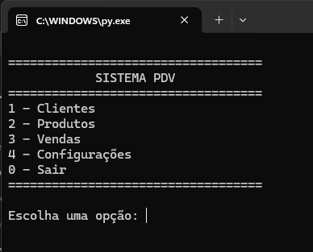
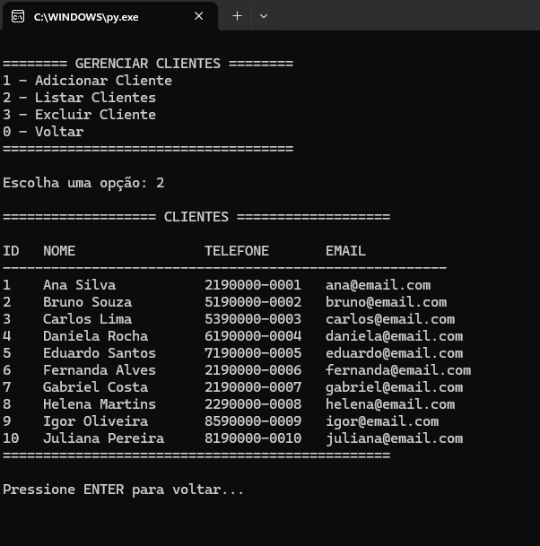

# 🛒 FastPDV

Sistema de Ponto de Venda (PDV) desenvolvido em Python utilizando SQLite para persistência de dados.

## 📋 Sobre o Projeto

O FastPDV é um sistema simples de gerenciamento de vendas via terminal, permitindo o cadastro e controle de:

- Clientes
- Produtos
- Vendas
- Estoque

O projeto foi desenvolvido com foco em aprendizado de Python, SQL e organização modular de sistemas.

---

## 🚀 Funcionalidades

### 👤 Clientes
- Cadastrar cliente
- Listar clientes
- Excluir cliente

### 📦 Produtos
- Cadastrar produto
- Listar produtos
- Excluir produto

### 💰 Vendas
- Registrar venda
- Selecionar cliente
- Selecionar produto
- Atualização automática do estoque
- Cálculo automático do valor total

### 🗄 Banco de Dados
- SQLite
- Criação automática das tabelas
- Popular banco com dados de exemplo

---

## 🖥️ Tecnologias Utilizadas

- Python 3
- SQLite3

---

## 📂 Estrutura do Projeto

```text
FastPDV/
│
├── database/
│   ├── fast-pdv.db
│   └── banco.py
│
├── clientes.py
├── produtos.py
├── vendas.py
├── main.py
│
├── imgs/
│   ├── 1.png
│   └── 2.png
│
├── .gitignore
└── README.md
```

---

## 📸 Screenshots

### Menu Principal



### Gerenciamento do Sistema



---

## 👨‍💻 Autor

Danilo Cavalcante

GitHub: https://github.com/daniloocavalcante

---

## 📄 Licença

Projeto desenvolvido para fins de estudo e aprendizado.